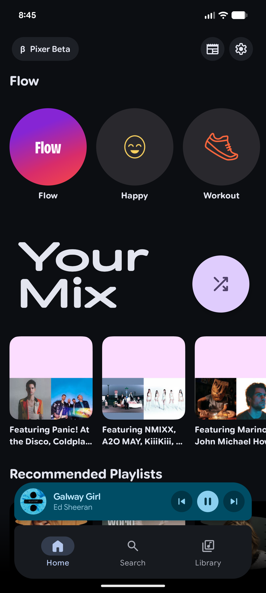
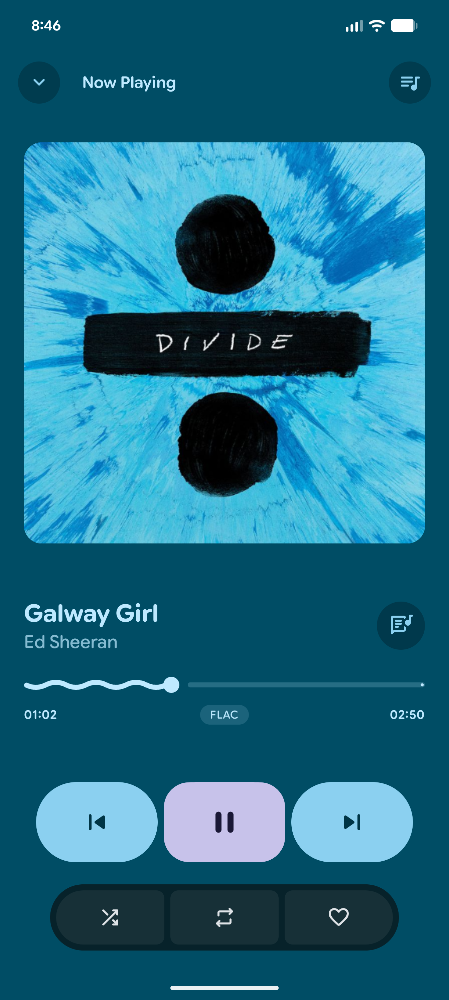
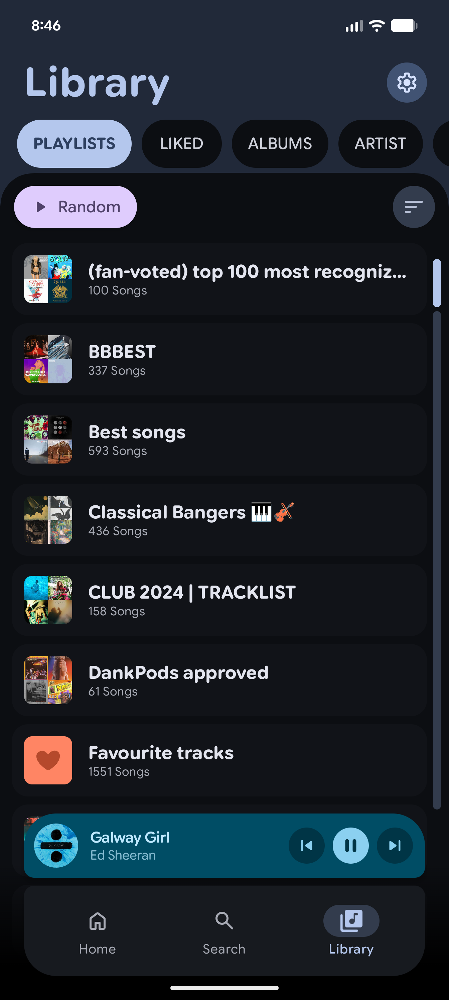
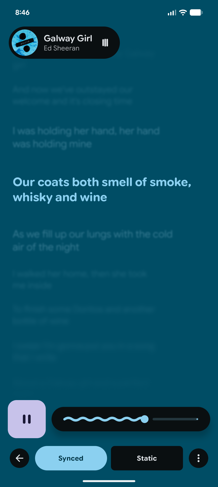

# Pixer

<p align="center">
  
</p>

<p align="center">
  <strong>An unofficial Deezer client for Android</strong>
</p>

<p align="center">
  <a href="https://github.com/Minuga-RC/Pixer/releases/latest">
    
  </a>
  <a href="https://github.com/Minuga-RC/Pixer/releases">
    
  </a>
  
  
</p>

<p align="center">
  
  
  
  
</p>

## What It Is

Pixer is a dedicated, unofficial Deezer client for Android. It focuses on providing a clean, expressive Material 3 UI for browsing, searching, and streaming music directly from Deezer. 

## Acknowledgements

This project is a fork of [PixelPlayerOSS](https://github.com/lostf1sh/PixelPlayerOSS), originally created by [@lostf1sh](https://github.com/lostf1sh). 

While the original PixelPlayerOSS focused on local playback and self-hosted music libraries, **Pixer** removes all local capabilities to focus entirely on being a streamlined, cloud-first Deezer experience. Huge thanks to the original developer for providing such an incredible foundation and UI!

## Features

| Area | Highlights |
| --- | --- |
| Playback | Media3 playback engine, gapless playback, custom transitions, queue controls, shuffle |
| Deezer Integration | Stream directly from Deezer. Browse albums, artists, playlists, and search for your favorite tracks. |
| UI | Jetpack Compose, Material 3, dynamic color, light/dark themes, animated player surfaces |

## Requirements

| Requirement | Version |
| --- | --- |
| Android | 11 or newer, API 30+ |
| JDK | 21 |
| Android SDK | compile/target 37 |

## Build From Source

Clone the repository:

```sh
git clone https://github.com/Minuga-RC/Pixer.git
cd Pixer
```

Build the debug APK:

```sh
./gradlew :app:assembleDebug
```

Build a signed release APK:

```sh
./gradlew :app:assembleRelease
```

## Tech Stack

| Area | Technology |
| --- | --- |
| Language | Kotlin |
| UI | Jetpack Compose |
| Design | Material 3 |
| Playback | AndroidX Media3, ExoPlayer |
| Dependency Injection | Hilt |
| Networking | Retrofit, OkHttp |
| Images | Coil |

## License

Pixer is licensed under the [MIT License](LICENSE).

<p align="center">
  Maintained by <a href="https://github.com/Minuga-RC">Minuga</a>
</p>
